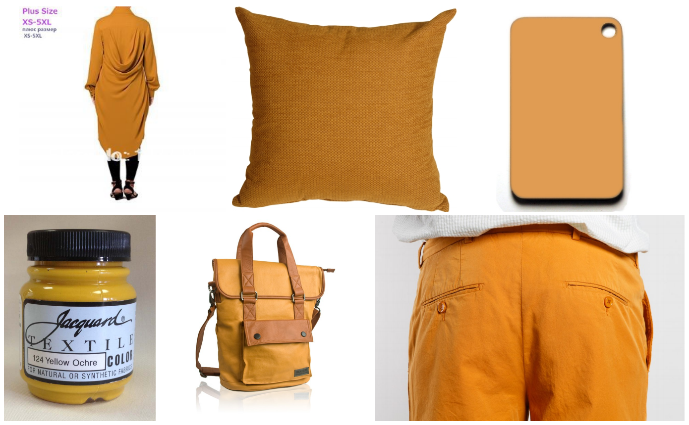
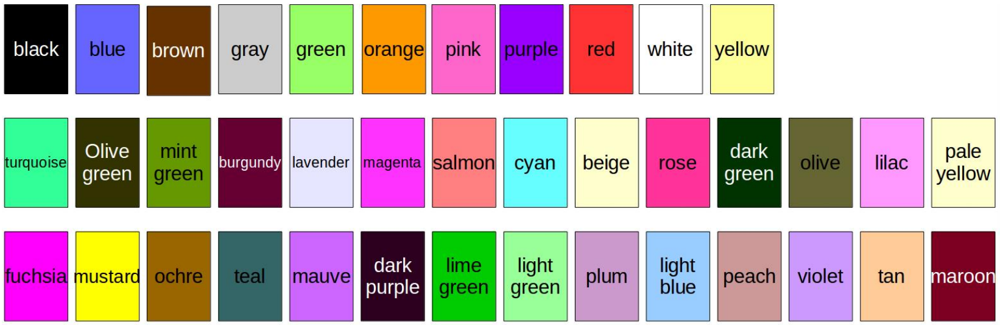

# Beyond Eleven Color Names for Image Understanding

The paper is published in Machine Vision and Applications. An [pre-print](https://www.cvc.uab.es/LAMP/wp-content/papercite-data/pdf/lu2018cn.pdf) version is available.

## Abstract

Color description is one of the fundamental problems of image understanding. One of the popular ways to represent colors is by means of color names. Most existing work on color names focuses on only the eleven basic color terms of the English language. This could be limiting the discriminative power of these representations, and representations based on more color names are expected to perform better. However, there exists no clear strategy to choose additional color names.
  We collect a dataset of 28 additional color names. To ensure that the resulting color representation has high discriminative
power we propose a method to order the additional color names according to their complementary nature with the basic color names. This allows us to compute color name representations with high discriminative power of arbitrary length. In the experiments we show that these new color name descriptors outperform the existing color name descriptor on the task of visual tracking, person reidentification and image classification.

## Authors

Lu Yu · Lichao Zhang · Joost van de Weijer · Fahad Shahbaz Khan · Yongmei Cheng · C. Alejandro Parraga

## The augmented color name dataset

We collect images from Google by using the search query ’colorname + objects’, e.g. ’mauve objects’. An example of six images for ’ochre objects’ is provided as follows. The complete **dataset** can be downloaded from [here](https://www.dropbox.com/s/gpuuj7zg0nwrrea/cn39_dataset.zip?dl=0). 

## Ranking additional color names

In the following images, top row is the eleven basic color terms, second and third row proposed order in which to add 28 additional color names to the basic color term set.

## New mapping matrices 
Code for examples of color naming image pixels is provided [here](./ExtendedColorNaming). Mapping matrices with extended color names and corresponding orders are provided [here](./ExtendedColorNaming/mapping_matrices).
